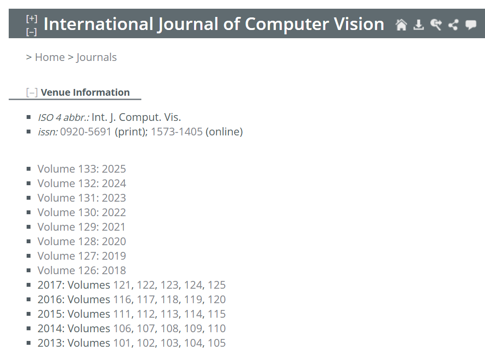
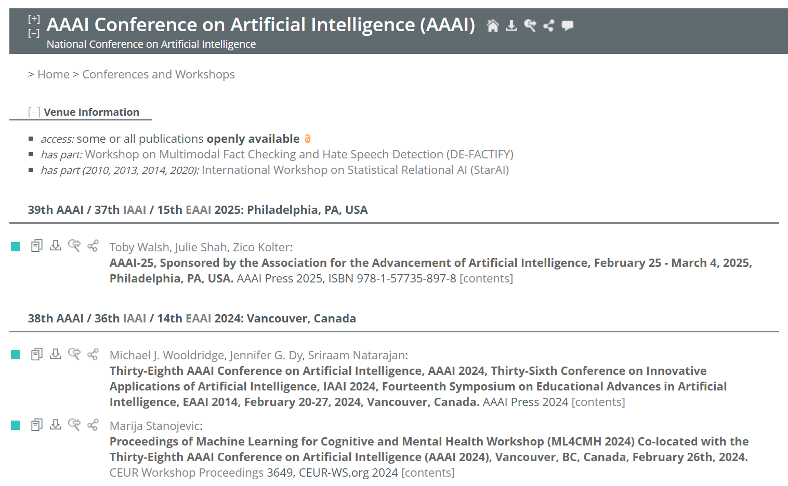

# 📚 paper-query

一个简洁易用的 Python 项目，支持根据 **CCF 等级**、**多个年份** 和 **多个关键词**，批量查询 [CCF 推荐目录](https://www.ccf.org.cn/Academic_Evaluation/By_category/) 中收录的会议或期刊的论文。

本项目基于《中国计算机学会推荐国际学术会议和期刊目录（2022 更名版）》进行开发与匹配，适用于科研人员进行文献回溯和选题分析。

---

## ✨ 功能简介

- ✅ 支持自定义板块及对应等级的期刊或会议进行查询，例如：

    ```python
    import_config = {
        "artificial_intelligence": ["journal_A", "conference_A"],
        "databases_and_data_mining": ["journal_A"]
    }
    ```

- ✅ 同时支持多个查询年份与多个关键词
- ✅ 自动爬取 **DBLP** 数据库内容，精准提取匹配论文标题
- ✅ 查询结果自动保存为 `.txt` 文件，命名格式为：`year-keyword.txt`
- ✅ 每条结果格式为：  
  `年份 - 会议/期刊名称 (A/B/C类 期刊/会议) - 匹配的论文标题`

---

## ⚡ 快速开始

### 📦 安装依赖

使用 pip 安装项目所需依赖：

```bash
pip install -r requirements.txt
```

---

### ⚙️ 配置要查询的期刊/会议

在 `tools/custom_info_generate.py` 中配置需要查询的条目：

```python
import_config = {
    "artificial_intelligence": ["journal_A", "conference_A"],
    "databases_and_data_mining": ["journal_A"]
}
```

脚本将自动读取 `ccf_info_by_section` 包中的预设 JSON 数据，从中提取对应板块与等级的所有期刊/会议条目，并生成一个新的 JSON 文件保存至 `custom_info` 目录中。

---

### 🚀 开始查询

在 `index.py` 中输入你要查询的多个年份和关键词，点击运行：

- 默认读取 `custom_info/default.json` 中的条目
- 如需自定义，请在 `custom_info/__init__.py` 中修改默认导入路径

查询结果将以 `.txt` 文件形式保存至 `query_result/` 文件夹中。

---

## ⚠️ 当前限制

本项目主要依赖爬虫抓取 DBLP 数据，目前支持以下两类网页结构：

### 📰 所支持的期刊页面结构：


### 🗓️ 所支持的会议页面结构：



## 🤝 贡献 & 联系

欢迎通过提交 [Issues](https://github.com/你的项目地址/issues) 或 [Pull Requests](https://github.com/你的项目地址/pulls) 参与项目改进！

如有建议、问题或合作意向，欢迎联系作者 ✉️。
